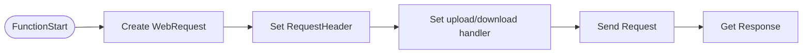

# 유저 데이터 로드

## 구현 목표

Unity에서 서버에 HttpRequest를 요청하는 함수 리팩토링 진행

데이터베이스에 플레이어의 스탯 정보 간단 설계

로그인 성공 시 타이틀에서 인게임 씬으로 전환 후 플레이어 스탯 정보 로드 후 적용

---

## 구현 결과

### [시연 영상](https://www.youtube.com/watch?v=eyocFzFvGaY)

Unity에서 ASP서버와 통신하는 메인 허브 코드

[TestWepRequest.cs](attachment:1fb60768-d6e3-43ce-b3b8-5438bc8d5b3b:TestWepRequest.cs)

Unity에서 서버로 Request를 하게 되면, 서버로부터 무조건 Response가 전달됩니다.

초기에는 각 기능별로(로그인, 회원가입 등) 함수를 제작하였는데 이렇게 되면 서버에 요청할 기능이 늘어날 때마다 함수를 새로 정의하는 번거로움이 있습니다.

그래서 서버로 요청을 보내고 결과를 받는 과정을 하나의 탬플릿 함수로 묶었습니다..

요청을 보내고 결과를 받는 과정을 한 눈에 플로우로 그리면 아래와 같이 됩니다.

여기서 body에 json data를 설정하는 uploadHandler에서는 class를 직렬화 하고, 반환받는 Response 데이터도 json에서 역직렬화 하기 때문에 탬플릿으로 묶어 사용할 수 있을 것이라 판단했습니다.

그래서 함수를 탬플릿으로 제작하여 하나의 함수로 모든 Request와 Response를 할 수 있도록 변경했습니다.

그리고 헤더에 부여할 수 있는 옵션도 있기 때문에, Dictionary 타입으로 헤더 옵션을 줄 수 있도록 했습니다.

그 외 로그인 성공시에는 SceneManager를 통해 Scene을 전환하게 했고, 전환 후 UI 에서 스탯 데이터를 불러오기 위해 데이터 요청을 전송하고, 수신하여 설정하는 과정까지 진행했습니다.

---
## 다음 구현 목표

다음 구현으로는, 출석 기능을 구현 시도해볼 생각입니다. 또는 간단한 게임 로직을 제작하여 재화의 저장과 소모 흐름을 구현해볼 생각입니다.
